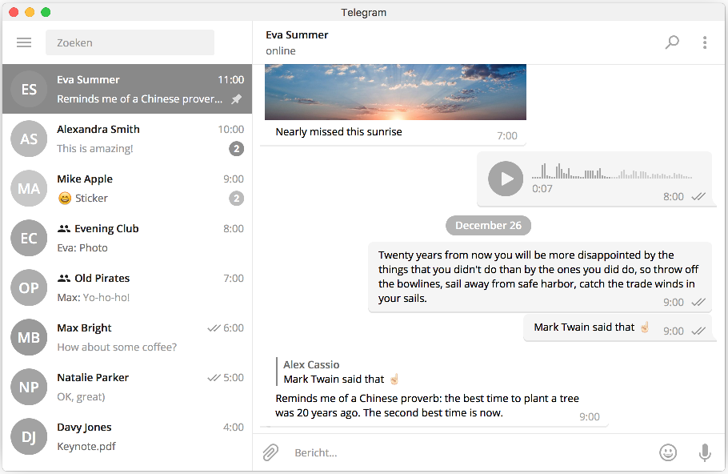

# Telegram Grayscale theme
A grayscale theme for Telegram Desktop.

## Installation
1. Open the following link with Telegram: [https://t.me/tthemebot?start=t357](https://t.me/tthemebot?start=t357).
2. Open the file `grayscale.tdesktop-theme`.
3. Apply the theme.
4. DONE!

## License
[MIT License](LICENSE).